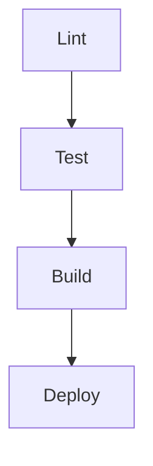

# CI/CD Setup Documentation

This document describes the Continuous Integration and Continuous Deployment (CI/CD) setup for the API Testing Framework.

## Overview

Our CI/CD setup consists of two separate workflows:

1. **Test Workflow** (`test.yml`) - Focused on comprehensive testing across Node.js versions
2. **CI/CD Pipeline** (`ci.yml`) - Production pipeline for main branch

## Workflow Details

### Test Workflow (`test.yml`)

The test workflow is dedicated to comprehensive testing and has the following characteristics:

- **Trigger Conditions**:

  - Runs on pushes to all branches
  - Runs on all pull requests
  - Runs daily at midnight UTC (cron job)

- **Features**:
  - Matrix testing across Node.js versions (18 and 20)
  - Parallel test execution
  - Shorter artifact retention (7 days)
  - Focused solely on testing
  - Generates types and runs tests
  - Uploads test reports per Node.js version

### CI/CD Pipeline (`ci.yml`)

The CI/CD pipeline is a production-focused workflow that includes:

- **Trigger Conditions**:

  - Runs on pushes to main branch only
  - Runs on pull requests to main branch

- **Jobs**:

  1. **Lint**:

     - TypeScript type checking
     - Runs first in the pipeline

  2. **Test**:

     - Single Node.js version (20)
     - Runs after lint passes
     - Focused on production configuration

  3. **Build**:

     - Runs after lint and test pass
     - Only on main branch pushes
     - Creates production build
     - Uploads build artifacts

  4. **Deploy**:
     - Runs after successful build
     - Downloads build artifacts
     - Deploys to production environment
     - Currently a placeholder

## Job Dependencies

## Available Scripts

The following npm scripts are available:

- `npm test` - Run tests locally
- `npm run test:headed` - Run tests with browser UI
- `npm run test:report` - Show the HTML test report
- `npm run test:ci` - Run tests in CI environment
- `npm run generate:types` - Generate TypeScript types
- `npm run build` - Build the project

## Test Reports

Test reports are automatically generated and uploaded as artifacts in GitHub Actions:

1. Go to the GitHub Actions tab
2. Select the workflow run
3. Scroll down to the Artifacts section
4. Download the appropriate report:
   - From test workflow: `playwright-report-node-18` or `playwright-report-node-20`
   - From CI pipeline: `playwright-report`

## Key Differences Between Workflows

| Feature                  | test.yml              | ci.yml                |
| ------------------------ | --------------------- | --------------------- |
| Primary Focus            | Comprehensive testing | Production readiness  |
| Trigger Branches         | All branches          | Main branch only      |
| Node.js Versions         | 18, 20 (matrix)       | 20 only               |
| Artifact Retention       | 7 days                | 7 days                |
| Additional Jobs          | None                  | Lint, Build, Deploy   |
| Scheduled Runs           | Daily                 | None                  |
| Environment Requirements | None                  | Production for deploy |
| Test Configuration       | Matrix testing        | Production settings   |

## Future Enhancements

Potential future enhancements to the CI/CD pipeline:

1. Add specific deployment steps
2. Implement test parallelization
3. Add code coverage reporting
4. Add automated security scanning
5. Implement automatic version bumping
6. Add staging environment
7. Add smoke tests after deployment
8. Add reusable workflow patterns
9. Implement caching strategies
